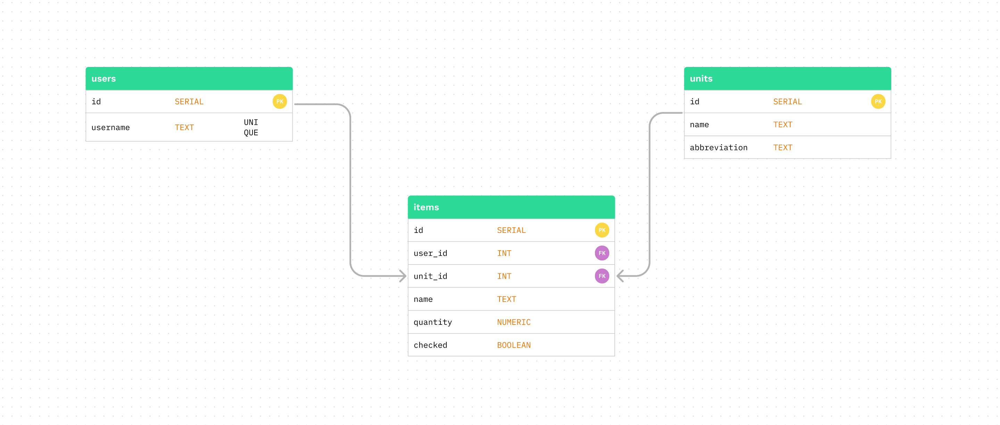

# Supermarket List API

Supermarket list API is a REST API made with Node, Express and PG. You can use for create Supermarket List apps, helping peoples to list your supermarket lists before going to supermarket

## Requirements

- Node.js
- Docker
- PG Admin (Optional to edit db)
- Insomnia (Optional to test)

## Documentation

### To test routes

---

```
Use insomnia to import the file below:
https://github.com/IgorSprovieri/supermarket-list-API/Insomnia.json
```

### Routes

---

[POST]/user
[GET]/user

**Routes above require username on header**

[PUT]/user
[DELETE]/user

[POST]/item
[GET]/items
[PUT]/item/:id
[DELETE]/item/:id

### Schemas

---

> User

- username [string]

> Item

- user_id [int]
- unit_id [int]
- name [string]
- quantity [float]
- checked [bool]

### Seeders

---

> Units

id: 1

- unit: Unidades
- abbreviation: Ud

id: 2

- unit: Pacote
- abbreviation: Pc

id: 3

- unit: Dúzia
- abbreviation: Dz

id: 4

- unit: Kilograma
- abbreviation: Kg

id: 5

- unit: Litro
- abbreviation: Lt

### To edit DB

---

```
Use PGadmin to access and edit DB
```



## Getting Started

1. Clone the repo

```
git clone https://github.com/IgorSprovieri/supermarket-list-API
```

2. Navigate to project folder and Install Dependencies

```
cd supermarket-list-API
npm install
```

3. Create the db on docker

```
docker run --name supermarket-list -e POSTGRES_PASSWORD=docker -e POSTGRES_USER=docker -p 5432:5432 -d -t postgres
```

4. Create a .env file following example:

```
user="docker"
host="localhost"
database="postgres"
password="docker"
port=5432
```

5. Run config script to create tables and lines:

```
npm run config:init
Observation: if dont't stop press CTRL + C
```

6. Run the project on dev mode

```
npm run start:dev
```

7. Build the project

```
npm run build
```

8. Run the project

```
npm run start
```

## Author


### _Igor Sprovieri Pereira_

Programming student since 2013, started working with Unity C# in 2020, paticipated in 16 team projects as a freelancer and his own game studio. At this time, he was a tutor on Crie Seus Jogos company, helping students and writing articles to company's website. In 2022 he decided to learn web development with HTML, CSS and JS. Actually he is fullstack programmer and he is specializing in react.js, node.js, docker, mongoose, postgres and sequelize.
